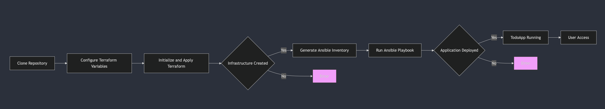
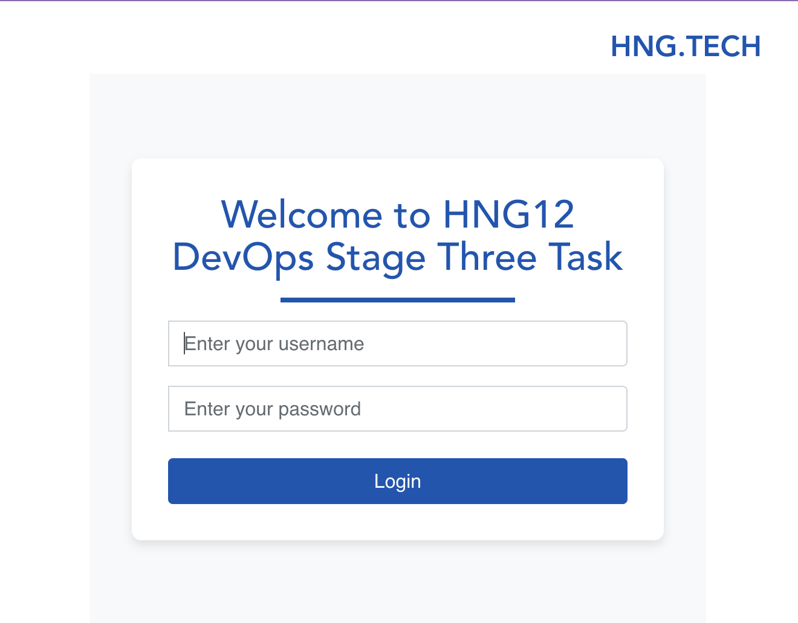
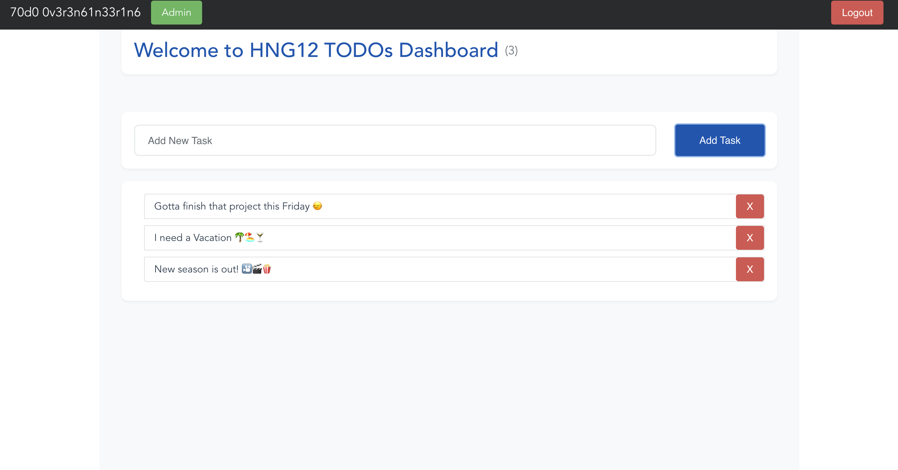

# TodoApp Infrastructure

This repository contains the infrastructure-as-code (IaC) for deploying and managing the TodoApp microservices application. The infrastructure is built using Terraform for provisioning cloud resources and Ansible for configuration management.

[](https://www.terraform.io/)
[](https://docs.ansible.com/ansible/latest/installation_guide/intro_installation.html)
[](https://aws.amazon.com/)
[](https://www.docker.com/)
[](https://traefik.io/)
[](https://opensource.org/licenses/MIT)

## Table of Contents
1. [Overview](#overview)
2. [Application Components](#application-components)
3. [Repository Structure](#repository-structure)
4. [Setup and Deployment](#setup-and-deployment)
5. [Troubleshooting](#troubleshooting)
6. [Contributing](#contributing)
7. [License](#license)
8. [Acknowledgements](#acknowledgements)

## Overview

TodoApp is a microservices-based application that provides user authentication, todo management, and activity logging across multiple interconnected services. This infrastructure repository automates the deployment and configuration of the entire application stack.



## Application Components

TodoApp consists of the following microservices:

- **Frontend**: A VueJS application providing the user interface
- **Auth API**: Written in Go, handles authorization and JWT token generation
- **TODOs API**: Built with NodeJS, manages CRUD operations for todo records
- **Users API**: A Spring Boot Java application for user profile management
- **Log Message Processor**: Python service that processes messages from Redis queue



## Repository Structure

```
todoapp-infra/
├── ansible/              # Ansible configuration for application deployment
│   ├── roles/            # Ansible roles for different aspects of the setup
│   │   ├── dependencies/ # System dependencies installation
│   │   └── deployment/   # Application deployment configuration
│   ├── ansible.cfg       # Ansible configuration
│   ├── deploy.yml        # Main deployment playbook
│   └── inventory.ini     # Generated by Terraform (do not edit manually)
│
├── terraform/            # Terraform configuration for infrastructure provisioning
│   ├── modules/          # Reusable Terraform modules
│   │   └── ec2/          # EC2 instance configuration
│   ├── keys/             # SSH keys for EC2 instances (generated, not tracked)
│   ├── templates/        # Templates for generating configuration files
│   ├── main.tf           # Main Terraform configuration
│   ├── variables.tf      # Variable definitions
│   ├── outputs.tf        # Output definitions
│   └── terraform.tfvars.example  # Example variables (copy to terraform.tfvars)
│
├── .gitignore            # Git ignore file
└── README.md             # This file
```

## Prerequisites

- [Terraform](https://www.terraform.io/downloads.html) (v1.0.0+)
- [Ansible](https://docs.ansible.com/ansible/latest/installation_guide/intro_installation.html) (v2.9+)
- [AWS CLI](https://aws.amazon.com/cli/) configured with appropriate credentials
- A registered domain name (optional, but recommended)
- SSH key pair for secure access

## Setup and Deployment

### 1. Clone the Repository

```bash
git clone https://github.com/yourusername/todoapp-infra.git
cd todoapp-infra
```

### 2. Configure Terraform Variables

```bash
cd terraform
cp terraform.tfvars.example terraform.tfvars
```

Edit `terraform.tfvars` with your specific values as shown in the `terraform.tfvars.example` file.

### 3. Initialize and Apply Terraform

```bash
terraform init
terraform plan
terraform apply
```

When prompted, review the changes and enter `yes` to proceed.

### 4. (Optional) Manual Ansible Deployment

The Terraform script automatically triggers Ansible, but if needed, you can run Ansible manually:

```bash
cd /path/to/todoapp-infra
# Run from the project root directory
ANSIBLE_TIMEOUT=3600 ANSIBLE_HOST_KEY_CHECKING=False ansible-playbook -i ansible/inventory.ini ansible/deploy.yml

# For debugging issues, add the -vvv flag
ANSIBLE_TIMEOUT=3600 ANSIBLE_HOST_KEY_CHECKING=False ansible-playbook -vvv -i ansible/inventory.ini ansible/deploy.yml
```

## Troubleshooting

### Common Issues

1. **Docker Build Failures**: Check individual service logs with `docker-compose logs [service_name]`
2. **SSL Certificate Issues**: Verify domain DNS configuration and Let's Encrypt rate limits
3. **Connection Timeouts**: Ensure security group allows access on required ports

### Logs and Monitoring

- Application logs are available via `docker-compose logs`
- Infrastructure changes are tracked in Terraform state
- Ansible execution logs provide deployment details

## Contributing

1. Fork the repository
2. Create a feature branch (`git checkout -b feature/amazing-feature`)
3. Make your changes
4. Commit your changes (`git commit -m 'feat: add amazing feature'`)
5. Push to the branch (`git push origin feature/amazing-feature`)
6. Open a Pull Request

## License

This project is licensed under the [MIT License](https://opensource.org/licenses/MIT) - see the LICENSE file for details.

## Acknowledgements

- TodoApp Microservices by [HNG Projects](https://github.com/hngprojects)
- Infrastructure automation inspired by best practices from AWS and HashiCorp

---

**Note**: This repository contains infrastructure code only. For the application code, refer to the [TodoApp repository](https://github.com/hngprojects/DevOps-Stage-4.git).


